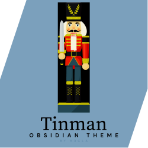

  A CSS theme for Obsidian!

---

If you want to see the theme fonts, install these:

- [Urbanist](https://fonts.google.com/specimen/Urbanist)
- [EB Garamond](https://fonts.google.com/specimen/EB+Garamond)
- [Source Code Pro](https://fonts.google.com/specimen/Source+Code+Pro)